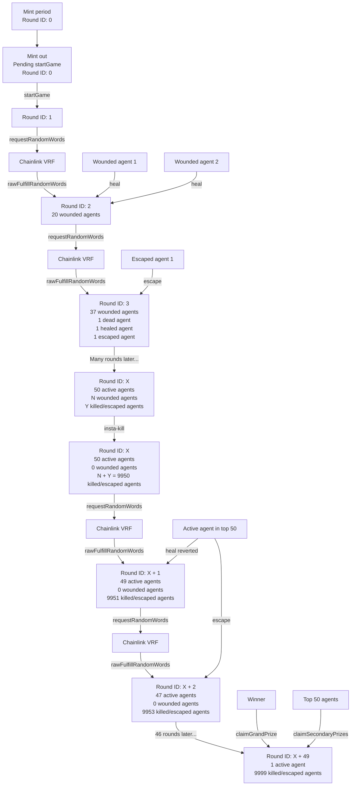

# @looksrare/contracts-infiltration

[](https://github.com/LooksRare/contracts-heist/actions/workflows/tests.yaml)
[](https://opensource.org/licenses/MIT)

## Description

LooksRare’s "Infiltration” is an on-chain Player vs Player (PVP) game. Users are able to spend ETH to mint "Agent" NFTs and have them enter a Compound to fight to the death, with the final remaining player winning the pot of remaining ETH from mint funds and the final 50 surviving agents winning additional ETH + LOOKS from healing fees in the endgame pool.

## Deployments

| Network  | Infiltration                                                                                                                       | InfiltrationPeriphery                                                                                                      |
| :------- | :--------------------------------------------------------------------------------------------------------------------------------- | :------------------------------------------------------------------------------------------------------------------------- |
| Ethereum | [0x0000000000000000000000000000000000000000](https://etherscan.io/address/0x0000000000000000000000000000000000000000#code)         | [0x0000000000000000000000000000000000000000](https://etherscan.io/address/0x0000000000000000000000000000000000000000#code) |
| Sepolia  | [0x02FCDB178Cc1e2Cf053BA1b8F7eF99D984C99Beb](https://sepolia.etherscan.io/address/0x02FCDB178Cc1e2Cf053BA1b8F7eF99D984C99Beb#code) | [0x7d3d6FC23d2321aC484bFBE200c110CDB5228b01](https://etherscan.io/address/0x7d3d6FC23d2321aC484bFBE200c110CDB5228b01#code) |

## The Flow



### Phase 1: Minting

There is a mint period in which players can mint their agent NFTs.

### Phase 2: Game Begins

After the mint period is over or when the max agent supply is reached, the contract owner can call the function `startGame` to kickoff the game. The function sets the initial game state and requests for randomness from Chainlink for the first round. The VRF callback returns a random word which is used to decide which agents will be wounded. When the callback is complete, round 2 begins.

Starting from round 2, players have the options to heal their wounded agents by paying LOOKS. In the next Chainlink VRF callback, the random value will be used to decide whether the healing agents will recover or die. If the healing agents recover, a portion of the healing fee will be burned. Agent owners have a number of blocks to decide whether to heal their wounded agents, but their agents will be killed if they don't heal their agents before this specified number of blocks passes.

Agent owners also have the option to escape from the game for an ETH reward. The total escape reward is split among the agent owner, the primary ETH prize pool and the secondary ETH/LOOKS prize pools.

### Phase 3: End of Battle

Once the game is down to 50 `Active` agents, all wounded agents will be killed and healing is disabled. In each round 1 agent will be instantly killed until there is only 1 agent left. In this phase agents can still escape from the game.

When the game is over, the winner can claim from the primary ETH prize pool and the top 50 players can claim from the secondary ETH/LOOKS prize pools.

## Agent Statuses

1. `Active`: The agent is active.

2. `Wounded`: The agent is wounded but still in the game. It can be healed but will be killed if no action is taken within `X` rounds.

3. `Healing`: The agent is healing. It might return to `Active` status or be killed depending on the random number it draws.

4. `Escaped`: The agent escaped and is out of the game.

5. `Dead`: The agent is dead and is out of the game

## Formulas

### Percentage Chance To Heal

The odds for an agent to heal successfully starts at 99% in round 1 and finishes at 80% in round 48. The exact percentage can be calculated using the equation below:

```math
PercentageChanceToHeal = EligibleRoundCount * (80 - 99) / (48 - 1) + (48 * 99 - 1 * 80) / (48 - 1)
```

So for example if an agent is wounded in round 12. The first round they can heal is round 13, let's mark this as EligibleRoundCount = 1. If they choose to heal on their 37th eligible round, then we would mark the EligibleRoundCount as 37.

### Escape

When an agent escapes, a portion of the escape value (defined as the ETH Remaining / Number of Active Agents) is given to the agent owner (we show the user this amount)

The percentage of the escape value which the agent owner earns upon escaping is determined by multiplying the escape value with the multiplier shown in the following equation:

```math
EscapeValueMultiplier = (-50 * (PercentageOfAgentsRemaining ** 2)) + 80
```

The remaining ETH amount is split between the original ETH Pool and the secondary ETH pot for the final 50 agents. The amount which should go to the secondary ETH pot can be calculated by taking the following percentage of the remaining ETH amount:

```math
PercentageOfSplitForTop50 = MIN(100, -8,000 / 99 * AgentsRemaining / TotalAgents + 9,980 / 99)
```

### Secondary ETH/LOOKS Prize Pools

The last 50 agents will receive a % of the secondary prize pool based on where they rank, for example:

Rank 1: 26.30% of ETH + LOOKS in secondary prize pool

Rank 3: 8.50% of ETH + LOOKS in secondary prize pool

….

Rank 49: 0.14% of ETH + LOOKS in secondary prize pool

Rank 50: 0.13% of ETH + LOOKS in secondary prize pool

In this example we used this equation:

```math
PercentageOfWinnings = 1.31817 * (995 / (Placement * 49) - 15 / 49)
```

## Certain Architectural Decisions

### Agents mapping

The `agents` mapping is used as an "array" to keep track of agents in the game. During the mint phase, Newly minted agents are not written to the `agents` mapping in order to save gas.
An agent is assumed to be active as long as its index is less than or equal to the number of agents remaining in the game (total supply - dead agents - escaped agents).

When an agent escapes or is killed, the smart contract writes its attributes to the last agent's index, and writes the last agent's attributes to the escaped/dead agent's index. It then
increments deadAgents or escapedAgents by 1, which in turn decrements the number of agents remaining by 1.

There is another mapping called `agentIdToIndex` that keeps track of each agent's index. If it returns 0, it means the agent's index is the same as its token ID.

### Wounded/Healing agent IDs per round

There is a maximum limit of 30 for wounded and healing agents per round. `woundedAgentIdsPerRound` and `healingAgentIdsPerRound` are 2 fixed sized array of 31 and the first element is the arrays' length.

## Running Tests

```
git clone git@github.com:sherlock-audit/2023-10-looksrare.git
cd 2023-10-looksrare

git submodule update --init --recursive
cd contracts-infiltration
yarn

forge build

export TENDERLY_ACCESS_KEY={key}
forge test
```
